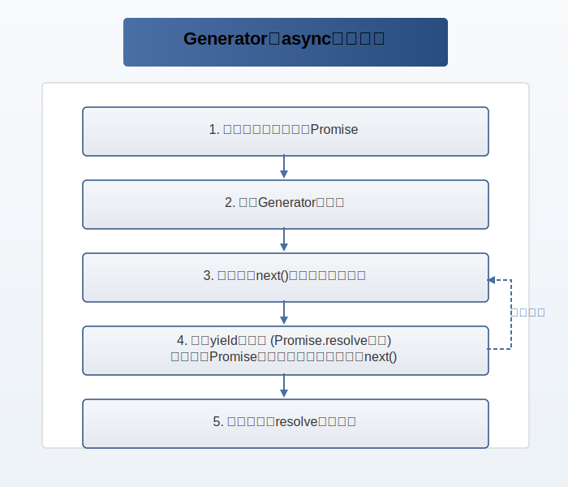

# 1. async/await 基础

## 1.1 async/await 语法

### 1.1.1 返回 Promise 对象

async 函数如果使用 return 返回了值（如果没有 return 则返回 undefined），这个值会被 Promise.resolve() 包装成一个 Promise 对象。

```js
async function foo() {
  return 3;
}

foo().then(console.log);
// 3
```

### 1.1.2 Promise 对象的状态变化

async 函数放回的 Promise 对象，必须等到内部所有的 await 命令后面的 Promise 对象执行完，才会发生状态改变。

如果有一个 await 命令后面的 Promise 对象变为 rejected，那么整个 async 函数就会中断执行。

```js
async function fetchUserData() {
  // 1. 先获取用户基本信息
  await fetch("/api/user/profile");
  // 2. 然后获取用户订单历史
  await fetch("/api/user/orders");
  // 3. 最后获取用户偏好设置
  await fetch("/api/user/preferences");

  return "所有用户数据加载完成";
}

fetchUserData().then(console.log);
// 输出: "所有用户数据加载完成"
```

上面代码中，函数 fetchUserData 内部有三个操作：获取用户基本信息、获取用户订单历史、获取用户偏好设置。只有这三个操作全部完成，才会执行 then 方法里面的 console.log。

### 1.1.3 await 命令

await 命令后面可以跟一个 Promise 对象，也可以跟一个普通值。

如果是 Promise 对象，await 会阻塞后面的代码，直到 Promise 对象 resolve，然后得到 resolve 的值。

如果是普通值，await 会返回这个值本身。

```js
// 示例1: await后面跟Promise对象
async function example1() {
  const result = await new Promise((resolve) => {
    setTimeout(() => resolve("异步操作完成"), 1000);
  });
  console.log(result); // 输出: "异步操作完成"
}

// 示例2: await后面跟普通值
async function example2() {
  const num = await 123;
  console.log(num); // 输出: 123
}

// 示例3: await处理异步函数
async function fetchData() {
  return "数据加载完成";
}

async function example3() {
  const data = await fetchData();
  console.log(data); // 输出: "数据加载完成"
}
```

> 从 ES2022 开始，await 可以在模块的顶层单独使用，不需要包裹在 async 函数中。
>
> 主要特点：1. 只能在 ES6 模块中使用，不能在 CommonJS 模块中使用。2. 模块会等待顶层 await 执行完成才会执行导入该模块的代码。3. 可以简化异步模块的初始化过程。4. 使模块能够异步加载资源。
>
> 使用场景：1. 模块初始化时需要异步加载配置。2.动态导入依赖。3.异步资源加载。

### 1.1.4 错误处理

如果 await 后面的异步操作出错，那么等同于 async 函数返回的 Promise 对象被 reject。如果 await 后面的 Promise 对象抛出错误，那么可以使用 try...catch 来捕获错误。

```js
// 异步操作出错导致Promise被reject
async function example1() {
  await Promise.reject("出错了！");
  return "这行不会执行";
}

example1().catch((err) => {
  console.log(err); // 输出: "出错了！"
});

// 使用try...catch捕获错误
async function example2() {
  try {
    await Promise.reject("出错了！");
  } catch (err) {
    console.log("捕获到错误:", err); // 输出: "捕获到错误: 出错了！"
    return "错误已处理";
  }
}

example2().then(console.log); // 输出: "错误已处理"
```

## 1.2 async/await 的使用

async 函数返回一个 Promise 对象，可以使用.then 方法添加回调函数。而 await 会阻塞后面的代码，直到 Promise 完成。下面是一个例子：

```js
async function example() {
  console.log("开始");
  await new Promise((resolve) => setTimeout(resolve, 1000));
  console.log("结束");
}

example().then(() => console.log("Promise完成"));
// 输出: "开始" "结束" "Promise完成"
```

上面的 example 函数，函数前面放一个 async，表示函数是异步函数，调用该函数时，会立即返回一个 Promise 对象。而 await 会阻塞后面的代码，直到 Promise 完成。所以输出顺序是："开始"，1 秒后输出"结束"，最后输出"Promise 完成"。


实际开发中，我们经常会遇到多个异步操作需要顺序执行的情况。比如，在一个后台管理系统中，用户登录后需要获取权限、加载菜单和初始数据。使用 async/await 可以让这些异步操作的代码更加清晰易读：

```js
async function initAdminDashboard(username, password) {
  try {
    // 1. 用户登录验证
    const loginResult = await userLogin(username, password);
    console.log(`登录成功，获取到token: ${loginResult.token}`);

    // 2. 获取用户权限
    const permissions = await getUserPermissions(loginResult.userId);
    console.log(`用户权限列表: ${permissions.join(", ")}`);

    // 3. 加载系统菜单
    const menus = await loadMenusByPermissions(permissions);
    console.log(`加载了${menus.length}个菜单项`);

    return {
      user: loginResult,
      permissions: permissions,
      menus: menus,
    };
  } catch (error) {
    console.error("初始化管理面板失败:", error);
    throw error;
  }
}

// 使用
initAdminDashboard("admin", "password123")
  .then((result) => {
    // 渲染页面
    renderDashboard(result);
  })
  .catch((err) => {
    // 显示错误信息
    showError(err.message);
  });
```

在这个例子中，我们使用 async/await 顺序执行了三个步骤：用户登录、获取权限、加载菜单。每一步都依赖于前一步的结果，使用 async/await 可以让代码按照同步的方式编写，避免了回调地狱，同时保持了异步执行的效率。

## 2.1 Generator 语法与特性

### 2.1.1 yield 表达式

yield 表达式是 Generator 函数中的一个关键字，用于暂停函数的执行并返回一个值。每次调用 next() 方法时，Generator 函数会执行到下一个 yield 表达式，返回值为 yield 表达式后面的值，为一个对象，包含两个值，value 和 done，value 为 yield 表达式后面的值，done 为一个布尔值，表示是否遍历结束，然后暂停执行，直到再次调用 next() 方法。

```js
function* simpleGenerator() {
  yield 1; // 第一次暂停点
  yield 2; // 第二次暂停点
  return 3; // 结束
}

const gen = simpleGenerator();
console.log(gen.next()); // { value: 1, done: false }
console.log(gen.next()); // { value: 2, done: false }
console.log(gen.next()); // { value: 3, done: true }
```

### 2.1.2 与 Iterator 接口的关系

任意一个对象的 Symbol.iterator 方法，等于该对象的遍历器生成函数，调用该函数会返回该对象的一个遍历器对象。

由于 Generator 函数就是遍历器生成函数，因此可以把 Generator 赋值给对象的 Symbol.iterator 属性，从而使得该对象具有 Iterator 接口。

```js
const myIterable = {
  *[Symbol.iterator]() {
    yield 1;
    yield 2;
    yield 3;
  },
};
[...myIterable]; // [1, 2, 3]
```

### 2.1.3 next 方法的参数

next 方法可以带一个参数，该参数会被当作上一个 yield 表达式的返回值。

```js
function* example() {
  console.log("开始");
  const value1 = yield "第一个值"; // 暂停执行，返回 "第一个值"
  console.log("第一个值:", value1); // 输出: "第一个值: 传入的值1"
  const value2 = yield "第二个值"; // 暂停执行，返回 "第二个值"
  console.log("第二个值:", value2); // 输出: "第二个值: 传入的值2"
  return "完成"; // 结束执行，返回 "完成"
}

const gen = example(); // 创建 Generator 函数的实例
gen.next(); // 输出: "开始"
gen.next("传入的值1"); // 输出: "第一个值: 传入的值1"
gen.next("传入的值2"); // 输出: "第二个值: 传入的值2"
gen.next(); // 输出: { value: '完成', done: true }
```

### 2.1.4 for...of 循环

for...of 循环可以自动遍历 Generator 函数生成的 Iterator 对象，无需手动调用 next 方法。

```js
function* numbers() {
  yield 1;
  yield 2;
  yield 3;
}
for (const num of numbers()) {
  console.log(num);
}
// 输出: 1 2 3
```

### 2.1.5 Generator.prototype.throw()

Generator.prototype.throw 方法用于在 Generator 函数内部抛出错误，并且可以在 Generator 函数外部捕获这个错误。

```js
function* example() {
  try {
    yield 1;
  } catch (error) {
    console.log("捕获到错误:", error);
  }
}
const gen = example();
gen.next(); // { value: 1, done: false }
gen.throw("出错了！"); // 输出: "捕获到错误: 出错了！" { value: undefined, done: true }
```

### 2.1.6 Generator.prototype.return()

Generator.prototype.return 方法用于结束 Generator 函数的执行，并返回给定的值。

```js
function* example() {
  yield 1;
  yield 2;
}
const gen = example();
gen.next(); // { value: 1, done: false }
gen.return("结束"); // { value: "结束", done: true }
gen.next(); // { value: undefined, done: true }
```

### 2.1.7 yield\* 表达式

yield\* 表达式用于在一个 Generator 函数中调用另一个 Generator 函数，将其内部的值直接返回给当前的 Generator 函数。

```js
function* innerGenerator() {
  yield 1;
  yield 2;
}

function* outerGenerator() {
  yield* innerGenerator();
  yield 3;
}

const gen = outerGenerator();
console.log(gen.next()); // { value: 1, done: false }
console.log(gen.next()); // { value: 2, done: false }
console.log(gen.next()); // { value: 3, done: false }
console.log(gen.next()); // { value: undefined, done: true }
```

## 2.2 Generator 的应用

### 2.2.1 异步操作的同步化表达

Generator 函数的暂停执行的效果，意味着可以把异步操作写在 yield 表达式里面，等到调用 next 方法时再往后执行。这实际上等同于不需要写回调函数了，因为异步操作的后续操作可以放在 yield 表达式下面，反正要等到调用 next 方法时再执行。所以，Generator 函数的一个重要实际意义就是用来处理异步操作，改写回调函数。

```js
function* asyncOperation() {
  const result1 = yield fetch("url1");
  const result2 = yield fetch("url2");
  return [result1, result2];
}
```

上面代码中，yield 表达式的位置分成两段，分别是异步操作 fetch('url1') 和 fetch('url2')。只有等到这两个操作完成，才会执行下一段。

### 2.2.2 控制流管理

Generator 函数可以方便地管理异步操作的执行流程，包括暂停、恢复和错误处理。这使得它在控制流管理方面非常强大，特别适用于需要协调多个异步任务的场景。

```js
function* controlFlow() {
  try {
    const result1 = yield fetch("url1");
    const result2 = yield fetch("url2");
    return [result1, result2];
  } catch (error) {
    console.error("发生错误:", error);
  }
}
```

上面代码中，try/catch 结构可以捕获异步操作中的错误，确保错误不会导致整个流程中断。

### 2.2.3 部署 Iterator 接口

Generator 函数返回的遍历器对象，部署了 Iterator 接口，利用 Generator 函数，可以在任意对象上部署 Iterator 接口。

```js
function* iterable() {
  yield 1;
  yield 2;
}
[...iterable()]; // [1, 2]
```

# 3. 使用 Generator 模拟 async/await

## 3.1 实现原理与思路

async 函数是 JavaScript 中用于处理异步操作的一种语法糖，其本质是基于 Promise 和 Generator 函数实现的。要理解如何使用 Generator 模拟 async/await，我们需要先了解两者之间的关系和核心原理。

### 3.1.1 async/await 与 Generator 的关系

1.  **语法对比**：

    - Generator 函数使用 `function*` 声明，使用 `yield` 暂停执行
    - async 函数使用 `async function` 声明，使用 `await` 等待 Promise 完成

2.  **执行方式**：

    - Generator 需要手动调用 `next()` 方法恢复执行
    - async 函数会自动执行，遇到 await 自动等待并恢复

3.  **返回值**：
    - Generator 返回一个迭代器对象
    - async 函数返回一个 Promise 对象

### 3.1.2 模拟实现的核心思路

要用 Generator 模拟 async/await，核心是创建一个自动执行器，它能够：

1.  接收一个 Generator 函数作为参数
2.  将 yielded 值包装成 Promise
3.  自动调用 Generator 的 `next()` 方法和 `throw()` 推进执行
4.  处理异步操作和错误传递

### 3.1.3 实现步骤详解

我们将通过以下步骤实现 Generator 到 async 的转换：

1.  **Generator 执行**：创建 generator 对象并逐步执行

2.  **Promise 包装**：将 yielded 值包装成 Promise

3.  **自动迭代**：自动调用 next()和 throw()方法

4.  **错误处理**：捕获异常并传递给 generator

### 3.1.4 执行流程图解

下面是 Generator 转 async 的实现思路流程图：



上图展示了 Generator 转换为 async 函数的实现思路：

1.  创建包装函数，返回 Promise
2.  创建 Generator 迭代器
3.  递归执行 next()，自动推进迭代器
4.  处理 yield 返回值，自动等待 Promise 完成并传递结果
5.  迭代完成时 resolve 最终结果

核心在于通过递归调用 next() 函数，自动处理每一个 yield 表达式并推进 Generator 的执行，从而实现类似 async/await 的自动执行异步流程。

## 3.2 generatorToAsync 函数实现

```js
/**
 * 将Generator函数转换为async函数
 * @param {GeneratorFunction} generatorFn - 需要转换的Generator函数
 * @returns {Function} - 返回一个返回Promise的async函数
 */
function generatorToAsync(generatorFn) {
  return function (...args) {
    const iterator = generatorFn.apply(this, args);
    return new Promise((resolve, reject) => {
      function next(data) {
        try {
          const {value, done} = iterator.next(data);
          if (done) {
            resolve(value);
          } else {
            // Promise.resolve确保所有值都是Promise
            Promise.resolve(value)
              .then(
                (data) => next(data),
                (err) => iterator.throw(err)
              )
              .catch((err) => {
                next(iterator.throw(err));
              });
          }
        } catch (error) {
          reject(error);
        }
      }
      next();
    });
  };
}
```
