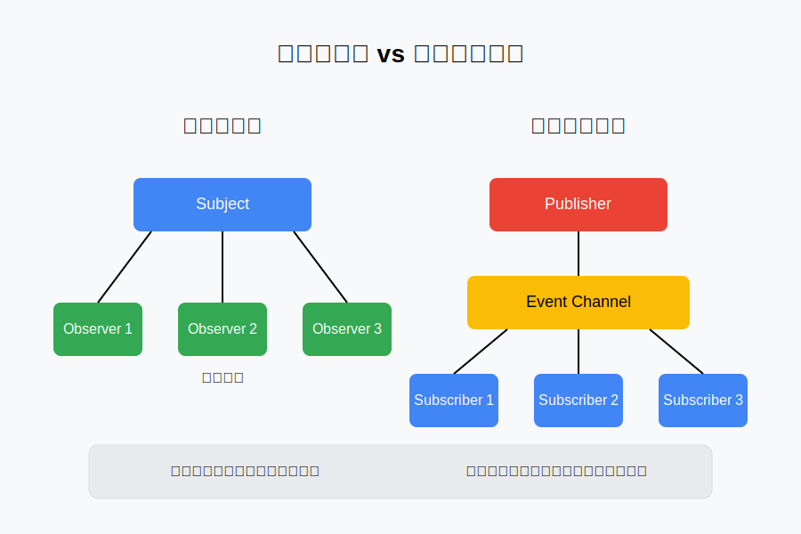
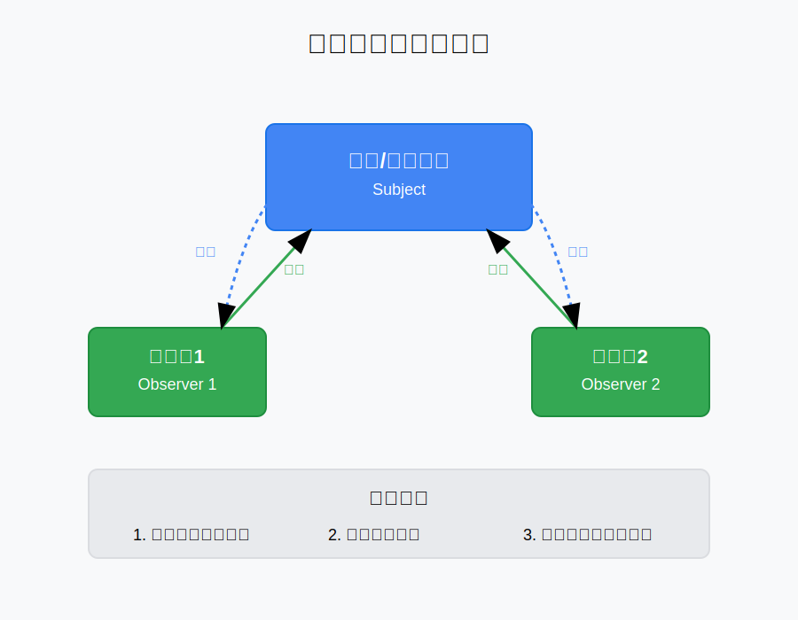

# 一、引言

观察者模式和发布订阅模式是前端开发中最常用的设计模式之一，它们都用于解决对象之间的通信问题，但实现方式和适用场景有所不同。

在前端开发中，这两种模式的应用非常广泛：

- **Vue.js 的响应式系统**：Vue 利用观察者模式实现数据与视图的自动同步
- **Redux/Vuex 等状态管理库**：基于发布订阅模式构建的状态管理解决方案

这两种模式看似相似，但在实现细节和应用场景上有着微妙的差别，很多开发者往往难以准确区分。本文将介绍这两种设计模式的核心概念、实现方法以及如何正确区分和应用它们。

# 二、观察者模式：直接沟通的艺术

## 2.1 核心思想与角色

核心思想：定义对象间的一种一对多的依赖关系，当一个对象的状态发生改变时，所有依赖于它的对象都得到通知并被自动更新。

首先举个例子描述一下观察者模式，假设你所在的城市有一个气象台，它会定期发布天气变化信息。你和其他关心天气的人可以订阅这个气象台的服务，当气象台发布新的天气信息时，所有订阅的人都会收到通知。这个过程就是一个典型的观察者模式。

在上述过程中，气象台只有一个，但是你和其他订阅气象台服务的人可以有多个，这多个订阅气象台服务的人就是观察者，他们订阅了气象台的服务，气象台就是被观察者，当气象台发布新的天气信息时，会通知所有订阅的人。

观察者模式中两个重要的角色就是被观察者（Observable）和观察者（Observer）。

## 2.2 实现要点分析

结合上面的例子，我们知道了，在观察者模式中，两个重要的角色是一定要出现的——被观察者和观察者。用面对对象的话来说，就是需要有两个类。

首先我们来看被观察者，回忆上面的例子，气象台服务收系是需要有一个被订阅的功能，然后还需要一个通知订阅人的功能，最后还需要一个取消订阅的功能。对应到观察者这个类里，就是需要一个添加观察者的方法，一个移除观察者的方法，一个通知所有观察者的方法。

## 2.3 代码实现

```js
/**
 * Subject类 - 被观察者
 * @class
 * @description 维护观察者列表,管理状态变化并通知观察者
 */
class Subject {
  /**
   * @constructor
   * @description 初始化观察者列表和状态
   */
  constructor() {
    this.observers = []; // 观察者列表
  }

  /**
   * 添加观察者到列表
   * @param {Observer} observer - 要添加的观察者对象
   * @description 如果观察者不存在则添加到列表中
   */
  addObserver(observer) {
    if (!this.observers.includes(observer)) {
      this.observers.push(observer);
    }
  }

  /**
   * 从列表中移除观察者
   * @param {Observer} observer - 要移除的观察者对象
   * @description 通过过滤方式移除指定观察者
   */
  removeObserver(observer) {
    this.observers = this.observers.filter((obs) => obs !== observer);
  }

  /**
   * 通知所有观察者
   * @description 遍历观察者列表并调用每个观察者的update方法
   */
  notify(data) {
    this.observers.forEach((observer) => observer.update(data));
  }
}

/**
 * Observer类 - 观察者
 * @class
 * @description 实现观察者模式中的观察者角色
 */
class Observer {
  constructor() {}
  /**
   * 更新方法
   * @param {any} data - 接收到的数据
   * @description 当被观察者状态改变时被调用
   */
  update(data) {
    console.log(`收到通知`, data);
  }
}
```

结合上面的例子，我们来实现一个气象台和订阅人的代码：

```js
class WeatherStation extends Subject {
  constructor() {
    super();
    this.weatherData = null;
    this.observers = [];
  }
  setWeatherData(data) {
    this.weatherData = data;
    this.notify(data);
  }
  getWeatherData() {
    return this.weatherData;
  }
}
class Person extends Observer {
  constructor(name) {
    super();
    this.name = name;
  }
  update(data) {
    console.log(`${this.name} 收到通知:${data}`);
  }
}
```

下面我们可以 new 一个 WeatherStation 对象（气象台），它可以调用 setWeatherData 方法来修改天气预报，每次天气发送变化，都会通知所有订阅者，这就实现我们核心思想里面的：当一个对象的状态发生改变时，所有依赖于它的对象都得到通知并被自动更新。

```js
const weatherStation = new WeatherStation();
const person1 = new Person("张三");
const person2 = new Person("李四");

// 订阅天气通知
weatherStation.addObserver(person1);
weatherStation.addObserver(person2);

// 天气变化，通知所有订阅者
weatherStation.setWeatherData("天气晴朗，温度25摄氏度");
weatherStation.removeObserver(person1);
weatherStation.setWeatherData("天气阴雨，温度23摄氏度");
```

# 三、发布订阅模式：加个中间人

## 3.1 核心思想与角色

核心思想：通过一个消息中心（消息总线）来传递消息，消息中心会保存所有订阅者，当有消息发布时，会通知所有订阅者。

同样用上面的例子，但气象台不再直接联系关心天气的人，而是通过一个中立的"消息调度中心"来发布消息。关心天气的人（订阅者）先向这个中心注册自己感兴趣的消息类型，比如晴天或雨天通知。当气象台检测到天气变化时，它会将消息发送给调度中心，调度中心再根据消息类型，将消息分发给所有订阅了该类型消息的人。这个就是发布订阅模式。

在上述过程中，气象台作为发布者负责收集和发布天气信息，消息调度中心作为中介，接收气象台发布的消息，并将消息分发给订阅者，订阅者通过消息调度中心订阅自己感兴趣的消息，并在收到消息时做出响应。

这就是发布订阅中的三个角色：发布者、订阅者、消息中心。

## 3.2 实现要点分析

结合上面的例子，我们来分析发布订阅模式的实现要点。在发布订阅模式中，最核心的是事件中心（Event Channel），它负责存储事件和订阅者的关系，并在事件发生时通知相关订阅者。

对应到代码里，我们存储事件和订阅者的关系，然后需要有订阅和取消订阅的功能，订阅的方法就是将订阅者添加到订阅者列表中，取消订阅的方法就是将订阅者从订阅者列表中移除。同时发布订阅模式还需要有一个发布事件的方法，当事件发生时，发布事件的方法会将事件类型和相关参数传递给事件中心，事件中心再根据事件类型，将参数分发给所有订阅了该事件的订阅者。

## 3.3 代码实现

```js
/**
 * 事件总线类 - 实现发布订阅模式
 * 用于组件/模块间的解耦通信
 */
class EventBus {
  constructor() {
    /**
     * 存储所有事件及其监听器
     * @type {Object<string, Set<Function>>}
     * @private
     */
    this.events = {};
  }

  /**
   * 注册事件监听器
   * @param {string} type - 事件类型/名称
   * @param {Function} fn - 事件处理函数/监听器
   */
  on(type, fn) {
    if (!this.events[type]) {
      this.events[type] = new Set();
    }
    this.events[type].add(fn);
  }

  /**
   * 触发指定类型的事件
   * @param {string} type - 事件类型/名称
   * @param {...any} args - 传递给事件处理函数的参数
   */
  emit(type, ...args) {
    this.events[type]?.forEach((fn) => fn(...args));
  }

  /**
   * 移除事件监听器
   * @param {string} type - 事件类型/名称
   * @param {Function} fn - 要移除的事件处理函数/监听器
   */
  off(type, fn) {
    this.events[type]?.delete(fn);
  }

  /**
   * 注册只执行一次的事件监听器
   * @param {string} type - 事件类型/名称
   * @param {Function} fn - 事件处理函数/监听器
   */
  once(type, fn) {
    const onceFn = (...args) => {
      fn(...args);
      this.off(type, onceFn);
    };
    this.on(type, onceFn);
  }
}
```

下面我们可以 new 一个 EventBus 对象，作为发布订阅模式的事件中心，然后定义两个订阅者 subscriber1 和 subscriber1 订阅天气通知，需要调用 emit 方法发布天气通知时，才会触发订阅者的回调函数。这就是发布-订阅的核心：通过事件中心解耦发布者和订阅者，所有事件的发布/订阅操作，必须经由事件中心。

```js
// 创建eventBus实例
const bus = new EventBus();

// 注册天气通知订阅者并保存引用
const subscriber1 = (message) => {
  console.log(`订阅者1收到天气通知: ${message}`);
};

const subscriber2 = (message) => {
  console.log(`订阅者2收到天气通知: ${message}`);
};

// 注册订阅者
bus.on("weatherNotification", subscriber1);
bus.on("weatherNotification", subscriber2);

// 发布天气通知
bus.emit("weatherNotification", "今天天气晴朗，适合户外活动！");

// 移除订阅者 - 使用保存的引用
bus.off("weatherNotification", subscriber1);

// 发布天气通知
bus.emit("weatherNotification", "今天天气阴天，不适合户外活动！");
```

# 四、傻傻分不清？多图看懂两者区别

## 4.1 结构对比图

观察者模式和发布订阅模式在结构上有着明显的区别，下图差异：



从上图可以看出：

- **观察者模式**：Subject（主题/被观察者）直接与 Observer（观察者）进行交互，是一种**直接通知**的机制，两者之间存在**强耦合**关系。
- **发布订阅模式**：Publisher（发布者）和 Subscriber（订阅者）之间通过 Event Channel（事件中心）进行通信，是一种**间接通知**的机制，两者之间存在**松耦合**关系。

## 4.2 关键实现差异

### 通信方式

**观察者模式**的工作流程：



**发布订阅模式**的工作流程：


# 五、总结：不再傻傻分不清

回到最早我们的例子，气象台直接通知所有订阅气象台服务的用户，这种**发布者直接触及到订阅者**的操作，叫观察者模式。但如果气象台不再直接通知订阅的气象台服务的用户，而是通知一个消息调度中心，调度中心再根据消息类型，将消息分发给所有订阅了该类型消息的人这种，**发布者不直接触及到订阅者、而是由统一的第三方来完成实际的通信的操作，叫做发布-订阅模式**。

在我们代码中也能看出，气象台直接通知订阅用户就是观察者模式，而通过 EventBus 去实现事件监听/发布，则属于发布-订阅模式。

我们可以思考一下：观察者模式的存在，其核心价值在于解决对象间的耦合问题。它通过将被观察者（主题）的状态变更与观察者（监听者）的具体行为分离，使得两者可以相对独立地变化，从而降低了系统各部分之间的依赖程度。然而，观察者模式虽然有效降低了耦合，但并未完全消除它——被观察者仍需维护一份观察者列表，观察者们也需要遵循统一的接口规范，两者之间依然存在一定的关联。

相比之下，发布-订阅模式则更进一步，实现了近乎完全的解耦。在这个模式中，发布者无需知晓任何订阅者的存在，也不关心订阅者如何处理消息；订阅者同样对发布者一无所知。所有的消息发布、订阅和路由都由一个独立的第三方平台（如事件总线）来管理。这就像一个彻底的“中介”，让发布者和订阅者之间不再有任何直接联系。

但这并非意味着发布-订阅模式就天然“优于”或“高级于”观察者模式。在实际开发中，我们对于模块解耦的需求并非总是追求绝对的零耦合。如果两个模块之间本身就存在紧密且稳定的功能关联，使用观察者模式往往更加直接和高效。反之，当模块间相对独立，且我们希望避免任何不必要的直接依赖时，发布-订阅模式则能提供更松散、更灵活的通信方式。选择哪种模式，关键在于根据具体场景和模块间的关系来权衡。
