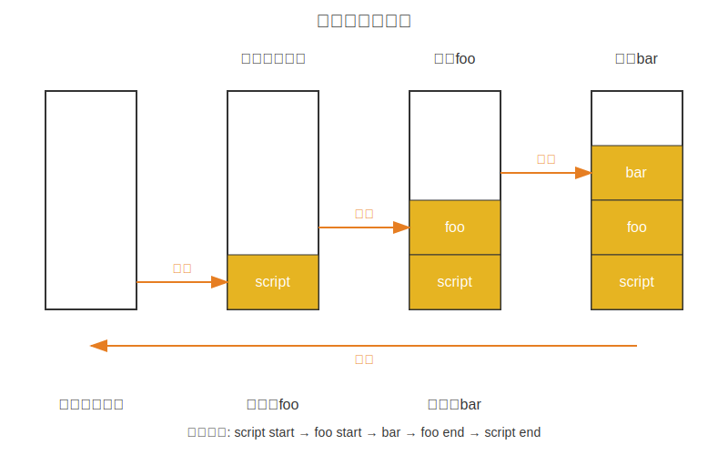
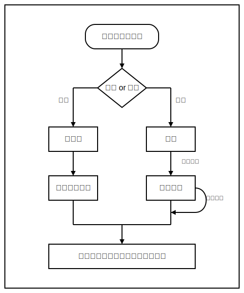

# 1. 基础概念

## 1.1 什么是事件循环

Event Loop（事件循环）是 JavaScript 的核心运行机制，它通过不断地从任务队列中读取并执行事件，使单线程的 JavaScript 能够高效处理并发操作。这一机制让 JavaScript 在执行同步代码的同时，能够响应用户交互、处理网络请求、执行定时器等异步任务，而不会阻塞主线程。无论是点击按钮、发送 AJAX 请求，还是 DOM 渲染，所有这些操作都由事件循环精确协调，确保它们在适当的时机被处理，从而实现了 JavaScript 的非阻塞特性。

事件循环主要由调用栈（Call Stack）、堆（Heap）和任务队列（Task Queue）组成。调用栈用于存放所有的同步任务；堆用于存储对象，是内存分配的地方；而任务队列则用于存放异步任务的回调函数，分为宏任务队列和微任务队列。

## 1.2 事件循环解决了什么

JavaScript 是一门单线程语言，这意味着它在同一时间只能执行一个任务。这种设计最初是为了简化 DOM 操作和浏览器交互，避免多线程环境下可能出现的复杂同步问题。

然而，单线程模型面临一个明显的问题：如何处理耗时操作而不阻塞整个程序？这就是事件循环发挥作用的地方。

想象一下繁忙餐厅里的一位服务员（JavaScript 的主线程）。这位服务员同一时刻只能做一件事，但需要同时应对多桌客人的需求：

1.  **接待新客人**
2.  **记录点餐**
3.  **将订单交给厨房**
4.  **上菜**
5.  **结账**

如果这位服务员在等待厨房做菜时就站在原地不动，那整个餐厅就会陷入瘫痪。聪明的服务员会怎么做？

- 将订单交给厨房后，不会站在那里等待
- 而是拿一个小铃铛
- 告诉厨房："菜做好了就摇铃铛叫我"
- 然后去服务其他客人
- 听到铃声后再去取餐

这就是事件循环的核心思想：**不等待，不阻塞**。主线程将耗时任务交给其他系统处理，自己继续执行后续工作，等到结果返回时再通过回调函数处理。

下面的代码展示了这一过程：

```javascript
console.log("服务员开始工作");

function greetNewCustomer() {
  console.log("欢迎光临，请问需要点什么？");
}

setTimeout(() => {
  console.log("厨房通知：菜品已准备好，请上菜");
}, 2000);

greetNewCustomer();
console.log("记录客人的订单并送至厨房");
console.log("服务员去招呼其他客人了");

// 输出顺序：
// 服务员开始工作
// 欢迎光临，请问需要点什么？
// 记录客人的订单并送至厨房
// 服务员去招呼其他客人了
// (2秒后) 厨房通知：菜品已准备好，请上菜
```

在这个例子中，服务员（JavaScript 主线程）不会在厨房做菜的过程中闲置等待，而是去完成其他工作。当厨房完成订单后，通过回调函数通知服务员来取餐。

这种单线程+事件循环的模型为 JavaScript 提供了处理异步操作的能力，而不需要引入多线程的复杂性。

# 2. 浏览器的事件循环

JavaScript 的任务分为同步任务和异步任务：

- 同步任务：在主线程上执行的任务，比如计算、读取数据等，这些任务是按顺序执行的，前一个任务执行完成后，才会执行下一个任务。
- 异步任务：不进入主线程，而是放在任务队列中，若有多个异步任务则需要在任务队列中排队等待，任务队列类似于缓冲区，任务下一步会被移到执行栈然后主线程执行调用栈的任务。

## 2.1 执行栈与任务队列

我们先来讲讲执行栈与任务队列。

1.  执行栈：
    javaScript 是单线程，也就是说只有一个主线程，主线程有一个栈，每一个函数执行的时候，都会生成新的 execution context（执行上下文），执行上下文会包含一些当前函数的参数、局部变量之类的信息，它会被推入（push）栈中， running execution context（正在执行的上下文）始终处于栈的顶部。当函数执行完后，它的执行上下文会从栈弹出（pop）。

    简单理解，执行栈就是一个先进后出（LIFO）的数据结构，类似于一摞盘子，后放上去的盘子先被拿走，每当一个函数执行，就 push 入栈，当函数执行完成，就 pop 出栈。举个例子：

```javascript
function foo() {
  console.log("foo start");
  bar();
  console.log("foo end");
}

function bar() {
  console.log("bar");
}

console.log("script start");
foo();
console.log("script end");

// 输出顺序为：
// script start
// foo start
// bar
// foo end
// script end
```

说明：

- 当调用 `foo` 函数时，`foo` 的执行上下文被推入执行栈顶。
- 在 `foo` 内部调用 `bar`，`bar` 的执行上下文被推入栈顶，先执行 `bar`。
- `bar` 执行完毕后，其执行上下文从栈顶弹出，控制权回到 `foo`。
- `foo` 执行完毕后，其执行上下文也从栈顶弹出，继续执行全局代码。

   <p align="center"></p>

2.  任务队列：
    任务队列（Task Queue）是一个先进先出（FIFO）的数据结构，类似于现实生活中排队等待的队伍。它专门用于存储异步任务的回调函数，确保这些任务能够按照正确的顺序被处理。

    JavaScript 执行机制的工作流程如下：

    - 同步任务直接进入执行栈，按照它们的顺序依次执行
    - 当遇到异步任务（如定时器、网络请求、事件监听器等）时，这些任务会被挂起并交给相应的 Web API 处理
    - 异步任务完成后，其回调函数会被放入任务队列中等待执行
    - 当执行栈为空时（即所有同步任务执行完毕），事件循环机制会检查任务队列，将队列中的回调函数按顺序取出并放入执行栈中执行
    - 这个过程会不断重复，直到执行栈和任务队列都清空为止

    下图直观展示了 JavaScript 任务执行的完整流程：

   <p align="center"></p>

事件循环（Event Loop）是 JavaScript 运行时环境的核心机制，它持续监控执行栈和任务队列的状态。当执行栈为空时，事件循环会从任务队列中取出第一个回调函数放入执行栈中执行，这个检查和执行的循环过程就是事件循环，每完成一次循环就是一个事件周期。

## 2.2 宏任务和微任务

任务队列又分为 Task Queue 和 Microtask Queue 两种。

- Task Queue：也称为宏任务队列，用于存储异步任务的回调函数。
- Microtask Queue：也称为微任务队列，用于存储微任务的回调函数。

1.  宏任务
    一个 Event Loop 会有一个或多个 Task Queue（宏任务队列），这是一个先进先出（FIFO）的有序列表，存放着来自不同 Task Source（任务源）的 Task。

    > 关于 Task，常有人称它为 Marcotask（宏任务），但其实 HTML 标准中并没有这种说法。

    在 html 中，常见的宏任务有： script( 整体代码)、setTimeout、setInterval、I/O、UI 交互事件、setImmediate(Node.js 环境)

2.  微任务
    Microtask Queue（微任务队列） 与 Task Queue 类似，也是一个有序列表。不同之处在于，一个 Event Loop 只有一个 Microtask Queue。

    在 html 中，常见的微任务有： Promise、MutaionObserver、process.nextTick(Node.js 环境)

## 2.3 事件循环的执行流程

我们首先用一段代码来看一下 Event Loop 在处理宏任务和微任务的逻辑是怎样的：

```javascript
console.log("script start"); // 1. 同步

setTimeout(function () {
  console.log("setTimeout"); // 5. 宏任务
}, 0);

Promise.resolve()
  .then(function () {
    console.log("promise1"); // 3. 微任务
  })
  .then(function () {
    console.log("promise2"); // 4. 微任务
  });

console.log("script end"); // 2. 同步
```

**分步解析：**

1.  **执行同步代码**

    - `console.log('script start')` 被压入调用栈并执行，控制台输出 `script start`。
    - 遇到 `setTimeout`，这是一个宏任务。浏览器将其回调函数交给定时器模块处理，然后主线程继续向下执行。
    - 遇到 `Promise.resolve().then()`，`.then()` 中的回调是一个微任务。它被添加到微任务队列（Microtask Queue）的末尾。
    - `console.log('script end')` 被压入调用栈并执行，控制台输出 `script end`。
    - 至此，所有同步代码执行完毕。

2.  **检查并清空微任务队列**

    - 在当前宏任务（即主脚本）执行结束后，事件循环会检查微任务队列是否为空。此时队列中包含 `promise1` 的回调。
    - 将 `promise1` 的回调压入调用栈执行，控制台输出 `promise1`。这个 `.then` 返回一个新的 Promise，并将其第二个 `.then` 的回调（`promise2`）添加到微任务队列的末尾。
    - 再次检查微任务队列，发现不为空，包含 `promise2` 的回调。
    - 将 `promise2` 的回调压入调用栈执行，控制台输出 `promise2`。
    - 现在，微任务队列为空。

3.  **执行下一个宏任务**
    - 事件循环检查宏任务队列（Macrotask Queue）。此时，`setTimeout` 的定时器已经到期（0 毫秒），其回调函数已被添加到宏任务队列中。
    - 从宏任务队列中取出 `setTimeout` 的回调，压入调用栈执行，控制台输出 `setTimeout`。

**最终输出顺序：**

```
script start
script end
promise1
promise2
setTimeout
```

**核心规则总结：**

事件循环的流程可以概括为以下几点：

1.  **执行一个宏任务**：从宏任务队列中取出一个任务来执行（在最开始，这个任务就是主脚本本身）。
2.  **清空微任务队列**：在该宏任务执行完毕后，立即执行所有在微任务队列中的任务，直到队列被清空为止。如果在执行微任务的过程中又产生了新的微任务，那么这些新的微任务也会被添加到队列的末尾，并在当前轮次中被执行。
3.  **开始下一轮循环**：返回第一步，从宏任务队列中取出下一个任务执行。

这个“执行一个宏任务 -> 清空所有微任务 -> 执行下一个宏任务”的循环，就是事件循环最核心的调度逻辑。

# 3. 最后

文章的最后总结一下，event loop 即事件循环，是指浏览器或 Node 的一种解决 javaScript 单线程运行时不会阻塞的一种机制，它通过一个不断循环的过程，解决了单线程语言在处理耗时操作时会阻塞主线程的问题。其工作方式是主线程执行完同步任务后，不断检查微任务队列并执行所有微任务，然后从宏任务队列中取出一个宏任务执行，如此循环。
