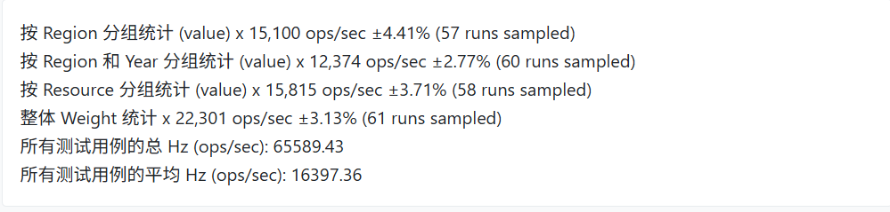
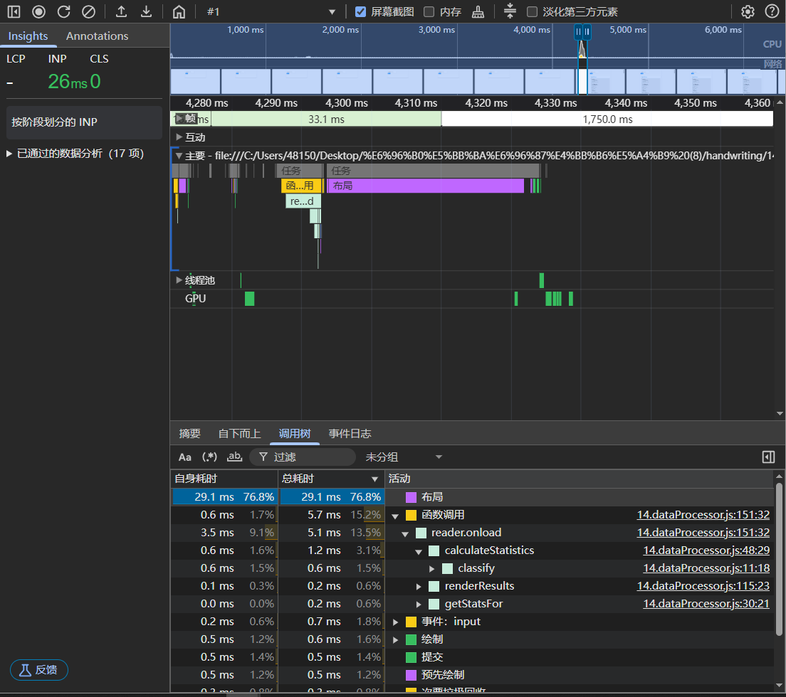

# 一、需求分析

## 1.1 数据结构

在实际开发中，我们经常需要处理复杂的数据集并进行统计分析。本案例中，我们处理的数据结构如下：

```json
{
  "nodes": [
    {
      "id": "node1",
      "region": "east",
      "year": 2021,
      "resource": "water",
      "value": 100,
      "weight": 0.8
    }
    // 更多数据...
  ]
}
```

## 1.2 统计维度

需要实现以下统计维度：

1. 按 region 分组统计 value 的总和、平均值、最小值、最大值和中位数
2. 按 region 和 year 组合分组统计 value 的各项指标
3. 按 resource 分组统计 value 的各项指标
4. 对所有数据的 weight 进行整体统计

# 二、逻辑梳理与技术选型

## 2.1 核心算法设计

数据统计功能的核心在于：

1. **数据分组**：根据指定的键（如  region、year、resource）对数据进行分组
2. **统计计算**：对分组后的数据计算统计指标（总和、平均值、最小值、最大值、中位数）

## 2.2 代码结构设计

将代码按功能模块划分为以下几个部分：

1. 核心数据处理函数 ：实现数据分组和统计计算
2. 基础统计函数 ：提供基本的统计计算（总和、平均值等）
3. UI 渲染函数 ：负责将计算结果展示在页面上
4. 事件处理函数 ：处理文件上传和性能测试等用户交互

# 三、功能实现

## 3.1 数据分组函数

```js
/**
 * 根据指定的键对数组进行分类
 * @param {Array} arr - 要分类的数组
 * @param {...string} args - 用于分类的键名
 * @returns {Map} - 返回分类后的Map对象，键为组合键名，值为符合条件的元素数组
 */
const classify = (arr, ...args) => {
  const map = new Map();
  arr.forEach((item) => {
    const key = args.map((arg) => item[arg]).join("_");
    if (map.has(key)) {
      map.get(key).push(item);
    } else {
      map.set(key, [item]);
    }
  });
  return map;
};
```

这个函数是整个数据处理的核心，它能够根据任意数量的键对数据进行灵活分组。例如：

- 传入 ['region'] 可以按地区分组
- 传入 ['region', 'year'] 可以按地区和年份的组合分组

## 3.2 统计计算函数

```js
/**
 * 计算数组中指定键的统计信息
 * @param {Array} arr - 要统计的数组
 * @param {string} key - 要统计的键名
 * @returns {Object} - 返回包含总和、平均值、最小值、最大值和中位数的统计对象
 */
const getStatsFor = (arr, key) => {
  const values = arr.map((item) => item[key]);
  return {
    sum: sum(values),
    mean: mean(values),
    min: min(values),
    max: max(values),
    median: median(values),
  };
};
```

基础统计函数的实现：

```js
// 计算总和
const sum = (arr) => arr.reduce((acc, val) => acc + val, 0);
// 计算平均值
const mean = (arr) => sum(arr) / arr.length;
// 获取最小值
const min = (arr) => Math.min(...arr);
// 获取最大值
const max = (arr) => Math.max(...arr);
// 计算中位数
const median = (arr) => {
  const sorted = [...arr].sort((a, b) => a - b);
  const mid = Math.floor(sorted.length / 2);
  return sorted.length % 2 !== 0
    ? sorted[mid]
    : (sorted[mid - 1] + sorted[mid]) / 2;
};
```

## 3.3 组合统计函数

```js
/**
 * 根据分组键和目标键计算统计信息
 * @param {Array} data - 要分析的数据数组
 * @param {Array} groupByKeys - 分组依据的键名数组
 * @param {string} targetKey - 要统计的目标键名
 * @returns {Object} - 返回按分组计算的统计结果
 */
const calculateStatistics = (data, groupByKeys, targetKey) => {
  if (!groupByKeys || groupByKeys.length === 0) {
    return getStatsFor(data, targetKey);
  }
  const grouped = classify(data, ...groupByKeys);
  const result = {};
  for (const [key, value] of grouped.entries()) {
    result[key] = getStatsFor(value, targetKey);
  }
  return result;
};
```

这个函数将分组和统计计算结合起来，实现了完整的数据统计流程。

## 3.4 文件上传和事件处理

# 四、性能测试

## 4.1 Benchmark

使用 Benchmark.js 库对不同的统计计算进行性能测试，获取它们的执行效率：

```js
// 性能测试处理
document
  .getElementById("runBenchmark")
  .addEventListener("click", function (event) {
    if (!data) {
      alert("请先上传文件");
      return;
    }
    const btn = event.target;
    btn.disabled = true;
    btn.textContent = "测试中...";
    const benchmarkResults = document.getElementById("benchmark-results");
    benchmarkResults.innerHTML = ""; // 清空之前的结果

    const suite = new Benchmark.Suite();
    suite
      .add("按 Region 分组统计 (value)", function () {
        calculateStatistics(data, ["region"], "value");
      })
      .add("按 Region 和 Year 分组统计 (value)", function () {
        calculateStatistics(data, ["region", "year"], "value");
      })
      .add("按 Resource 分组统计 (value)", function () {
        calculateStatistics(data, ["resource"], "value");
      })
      .add("整体 Weight 统计", function () {
        getStatsFor(data, "weight");
      })
      .on("cycle", function (event) {
        // 每个测试完成一个周期后触发
        benchmarkResults.innerHTML += String(event.target) + "<br>";
      })
      .on("complete", function () {
        // 所有测试完成后触发
        const fastest = this.filter("fastest").map("name");
        const totalHz = this.reduce((sum, bench) => sum + bench.hz, 0);
        const averageHz = totalHz / this.length;

        benchmarkResults.innerHTML +=
          "<br><strong>最快的是: " + fastest + "</strong><br>";
        benchmarkResults.innerHTML +=
          "<strong>总Hz: " + totalHz.toFixed(2) + "</strong><br>";
        benchmarkResults.innerHTML +=
          "<strong>平均Hz: " + averageHz.toFixed(2) + "</strong>";

        btn.disabled = false;
        btn.textContent = "性能测试";
      })
      .run({async: true});
  });
```

   <p align="center"></p>

我们可以每一次修改代码都可以通过多个用例感知我们的代码在不同场景下的性能表现，从而优化代码。

## 4.2 devtools performance 面板火焰图

我们可以通过 Chrome DevTools Performance 面板的火焰图来分析代码的性能问题。从火焰图中，我们可以直观地看到各个函数的执行时间和调用关系。

   <p align="center"></p>

从截图中的火焰图可以看出：

1. 主要耗时操作集中在数据处理和布局阶段

2. 数据处理流程中，主要耗时函数包括：

- 布局 （Layout）：占用了大量时间，约 1750.0 ms
- reader.onload ：文件读取和数据处理的入口函数
- calculateStatistics ：统计计算函数
- classify ：数据分类函数
- getStatsFor ：获取统计信息的函数

通过火焰图分析，我们可以感知到那一步可能造成性能问题，从而有针对性地进行优化。
